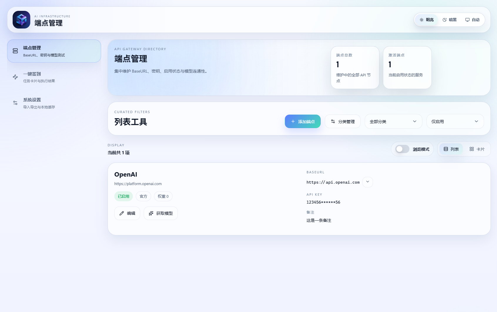
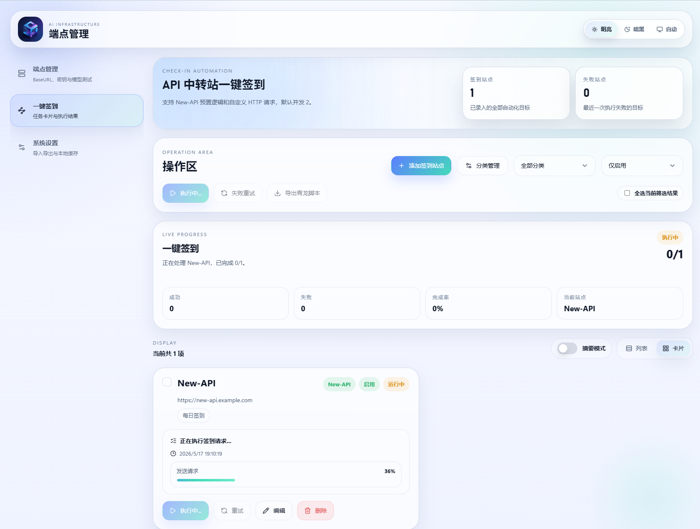

<div align="center">


---


# AI Endpoint Manager

**AI 大模型端点管理工具**

一站式管理API 端点、密钥与中转站签到任务

[](https://vuejs.org/)
[](https://lucide.dev/)
[](https://developer.chrome.com/docs/extensions/mv3/)
[](https://vitejs.dev/)

[English](./README_EN.md) | 中文

</div>

---

## 项目背景

在日常使用中，经常会遇到各类第三方服务——有些是一次性的公益站点、有些是自建的中转服务。出于屯屯鼠或者一次性Key经常失效的缘故，这些 API 端点可能需要在不同端点之间快速切换和测试。本工具为此场景设计：在浏览器本地收录和管理这些 API 端点，并提供中转站签到自动化功能。

## ✨ 功能特性

### 🔗 端点管理

管理APIKEY的基本功能均已提供，如有其他需要请提交



### ✅ 签到自动化



- **New-API 预设模式** — 提供基于`New-API`的快速设置
- **自定义 HTTP 模式** — 支持任意 HTTP 请求配置（URL、方法、请求头、请求体）
- **curl 命令导入** — 解析 `curl` 命令（bash 与 Windows cmd 格式），自动填充请求参数
- **成功/失败关键词检测** — 可配置关键词列表，智能判定签到结果
- **批量签到** — 一键执行多站点签到，支持并发控制（1-10，默认 2）
- **失败重试** — 仅重试上次失败的站点，避免重复请求
- **脚本导出** — 生成独立 Node.js 签到脚本，支持配置 cron 定时（每日 / 每 8 小时 / 每周 / 自定义）
  
### ⚙️ 系统设置

- **签到并发数控制** — 灵活调节并发请求数量（1-10）
- **数据导出** — 一键导出所有配置数据为 JSON 备份文件（端点、签到站点、分类、设置）
- **数据导入** — 从 JSON 文件恢复配置
- **清空数据** — 确认后彻底清除所有本地数据
- **表单草稿持久化** — 编辑表单自动保存，下次打开时恢复上次填写状态

### 🎨 界面与体验

- **双模式展示** — 浏览器扩展弹窗模式与独立全屏窗口模式
- **亮色/暗色主题** — 支持亮色、暗色与跟随系统三种主题模式
- **所有数据本地存储** — 扩展模式使用 `chrome.storage.local`，网页模式使用 `localStorage`，无需服务器，可以纯本地模式

---

## 🛠️ 技术栈

| 技术 | 版本 | 用途 |
|------|------|------|
| Vue 3 | 3.5 | 核心框架（Composition API + `<script setup>`） |
| lucide-vue-next | 1.0 | 图标库 |
| @vueuse/core | 14.2 | 工具函数（主题切换等） |
| vuedraggable | 4.1 | 拖拽排序 |
| Sass | 1.99 | 样式预处理 |
| Vite | 8.0 | 构建工具 |
| Chrome Manifest V3 | — | 浏览器扩展规范 |

---

## 📦 项目结构

```
ai-endpoint-manager/
├── public/
│   ├── icon.png              # 扩展图标
│   └── manifest.json         # Chrome 扩展 Manifest V3 配置
├── src/
│   ├── main.js               # 应用入口（Vue 初始化、模式检测）
│   ├── App.vue               # 主应用组件（布局与导航）
│   ├── style.css             # 全局样式与设计令牌（CSS 变量，含亮/暗主题）
│   ├── composables/
│   │   └── useManagerState.js # 核心状态管理与业务逻辑
│   ├── components/
│   │   ├── views/
│   │   │   ├── EndpointSection.vue   # 端点管理视图
│   │   │   ├── CheckinSection.vue   # 签到自动化视图
│   │   │   └── SettingsSection.vue  # 系统设置视图
│   │   ├── dialogs/
│   │   │   ├── EndpointDialog.vue   # 端点编辑弹窗
│   │   │   ├── CheckinDialog.vue    # 签到站点编辑弹窗
│   │   │   ├── ExportDialog.vue     # 青龙脚本导出弹窗
│   │   │   ├── ModelsDialog.vue     # 模型列表弹窗
│   │   │   ├── ModelTestDialog.vue  # 模型测试结果弹窗
│   │   │   ├── RemarkDialog.vue     # 备注查看弹窗
│   │   │   └── ConfirmDialog.vue    # 确认对话框
│   │   └── ui/
│   │       ├── AppModal.vue         # 通用弹窗组件
│   │       ├── AppSelect.vue        # 自定义选择器
│   │       ├── AppCombobox.vue      # 自定义组合框
│   │       ├── ThemeSwitcher.vue    # 主题切换组件
│   │       └── ToastStack.vue       # Toast 通知栈
│   └── utils/
│       └── viewMode.js       # 视图模式检测（弹窗 vs 独立窗口）
├── index.html                # 入口 HTML
├── vite.config.js            # Vite 构建配置
├── package.json              # 项目依赖与脚本
└── pnpm-lock.yaml            # 包管理器锁文件
```

---

## 🚀 快速开始

### 环境要求

- [Node.js](https://nodejs.org/) >= 18
- [pnpm](https://pnpm.io/)（推荐）或 npm

### 安装依赖

```bash
pnpm install
```

### 开发模式

```bash
pnpm dev
```

启动本地开发服务器，在浏览器中打开即可调试。开发态默认以完整独立页布局打开；如需模拟插件弹窗尺寸，请访问 `http://localhost:5173/?mode=popup`。

### 生产构建

```bash
pnpm build
```

构建产物输出到 `dist/` 目录。

### 安装为 Chrome 扩展

1. 运行 `pnpm build` 生成 `dist/` 目录
2. 打开 Chrome，访问 `chrome://extensions/`
3. 开启右上角「开发者模式」
4. 点击「加载已解压的扩展程序」
5. 选择项目的 `dist/` 文件夹
6. 扩展图标将出现在浏览器工具栏中，点击即可使用

### 本地预览构建产物

```bash
pnpm preview
```

---

## 🔧 扩展权限说明

本扩展请求以下 Chrome 权限：

| 权限 | 用途 |
|------|------|
| `storage` | 存储端点配置、签到站点、分类、设置等本地数据 |
| `clipboardWrite` | 复制 BaseURL 和 API Key 到剪贴板 |
| `tabs` | 在独立窗口中打开管理页面 |
| `windows` | 创建和管理独立弹窗窗口 |
| `<all_urls>` (host) | 向外部 API 端点发送测试请求和签到请求 |

所有数据完全存储在本地浏览器中，**不会上传到任何服务器**。

---

## 💾 数据存储

本工具的所有数据完全存储在浏览器本地：

- **扩展模式** — `chrome.storage.local`
- **网页模式** — `localStorage`


## 🤝 贡献

欢迎贡献！你可以通过以下方式参与：

1. **Fork** 本仓库
2. 创建你的功能分支 (`git checkout -b feature/amazing-feature`)
3. 提交你的修改 (`git commit -m 'Add some amazing feature'`)
4. 推送到分支 (`git push origin feature/amazing-feature`)
5. 提交 **Pull Request**

---

## 📄 许可证

本项目采用 MIT 许可证。详见 [LICENSE](./LICENSE) 文件。

---

<div align="center">

**如果这个工具对你有帮助，请给个 ⭐ Star 支持一下！**

</div>
